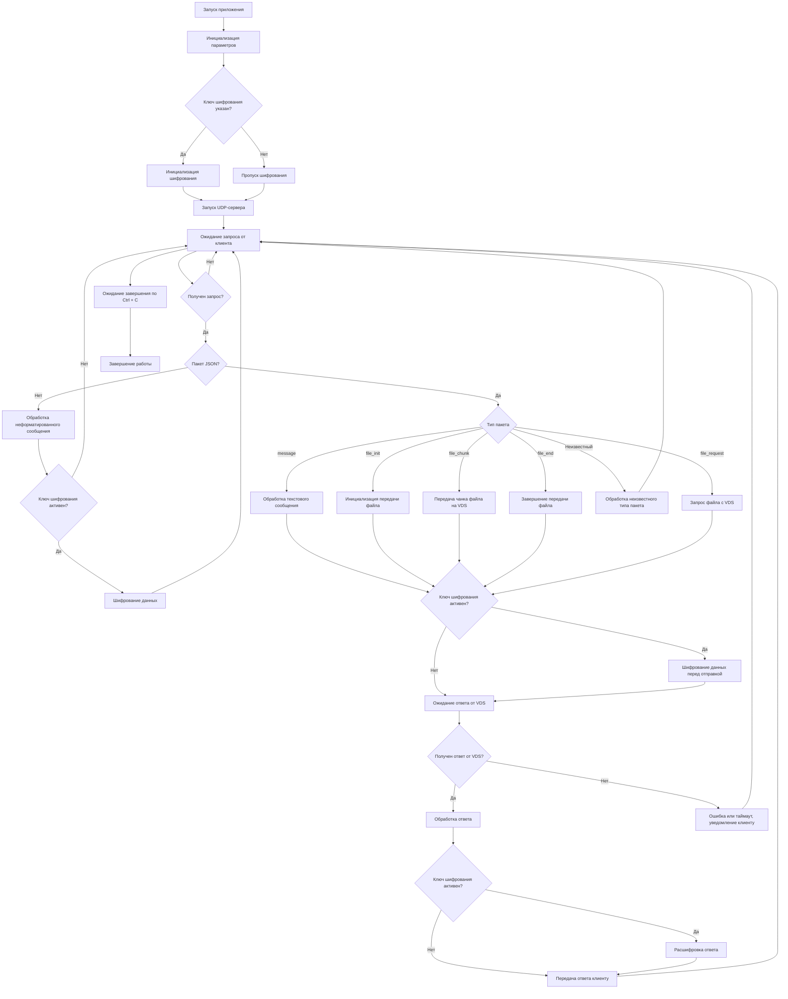

[[Python]]
#proxy
udp_proxy_project/
│── proxy.py   # Код UDP-прокси
│── client.py  # Тестовый клиент
│── server.py  # Тестовый сервер VDS или локальный

**1. Команды:**
```bash
# при 1 подключении -> требуется трассировка маршута
tracert 138.124.19.67  # В Windows
traceroute 138.124.19.67  # В Linux/macOS
#  потом
python proxy.py --listen-ip 127.0.0.1 --listen-port 9999 --target-ip 192.168.1.10 --target-port 8888
# OR
# Linux/macOS
python3 proxy.py --listen-ip 0.0.0.0 --listen-port 9999 --target-ip 138.124.19.67 --target-port 8888
# В Windows
python proxy.py --listen-ip 0.0.0.0 --listen-port 9999 --target-ip 138.124.19.67 --target-port 8888
python proxy.py --listen-ip ~~127.0.0.1~~ --listen-port 9999 --target-ip 138.124.19.67 --target-port 8888

# OR по умолчанию (Тогда proxy будет слушать на **127.0.0.1:9999**):
python proxy.py --target-ip 192.168.1.10 --target-port 8888
python proxy.py --target-ip 138.124.19.67 --target-port 8888

python server.py
python client.py
```


```bash
python --version
# ответ
Python 3.13.x
# 
python3.13 -m venv venv
source venv/bin/activate
```

**Скопируйте `server.py` на VDS**  
На локальной машине (где у вас файлы) выполните команду:
```bash
scp -P 22542 serverCrypto.py root@138.124.19.67:~/
# и обратно с сервера
scp -P 22542 root@138.124.19.67:~/serverCrypto.py "C:\Project\ProjectPython\ProxyCrypto"
```

2. Команды:
🔥 **Как прервать сервер и освободить порт?**
```bash
# узнать, какой процесс занимает нужный порт (например, `8888`)
lsof -i :8888
OR
netstat -tulnp | grep 8888
# вывод 
# python3   12345  root  3u  IPv4  12345678  0t0  UDP *:8888
# 12345 — PID (идентификатор процесса)
kill -9 12345
# после этого порт освободится, и можно запустить сервер заново
```

# Алгоритм работы UDP-proxy
### **Обновлённый текстовый алгоритм работы UDP-прокси:**

1. **Запуск приложения.**
    - Инициализируются параметры командной строки: IP и порт для прослушивания, IP и порт целевого VDS, ключ шифрования (если указан).
2. **Проверка наличия ключа шифрования.**
    - Если ключ указан, инициализируется механизм шифрования (Fernet).
    - Если ключ не указан, шифрование отключается.
3. **Запуск UDP-сервера.**  
    Сервер начинает прослушивание на указанном IP и порту, ожидая подключения клиентов.
---

### 🔹 **Обработка входящих запросов от клиента:**

4. **Ожидание получения данных от клиента.**  
    Сервер ожидает данные от клиента (локальный IP 127.0.0.1).  
    Если запрос не получен, продолжается ожидание.
5. **Проверка формата данных:**
    - Если данные в формате JSON — анализируется тип пакета.
    - Если данные не являются JSON — обрабатываются как обычное текстовое сообщение.
---

### 🔹 **Обработка типов пакетов JSON:**

6. **Тип пакета JSON:**
    - **message:** Текстовое сообщение. Если шифрование активно — данные шифруются перед пересылкой на VDS.
    - **file_init:** Инициализация передачи файла. Если шифрование активно, инициализационные данные шифруются.
    - **file_chunk:** Передача чанка файла на VDS. Данные шифруются при активном шифровании.
    - **file_end:** Завершение передачи файла. Сигнал завершения шифруется при необходимости.
    - **file_request:** Запрос файла с VDS. Запрос шифруется, если ключ активен.
    - **Неизвестный тип:** Сообщение игнорируется, отправляется уведомление об ошибке.
---

### 🔹 **Шифрование и отправка на VDS:**

7. **Проверка шифрования перед отправкой:**
    - Если ключ шифрования активен, данные шифруются перед отправкой на VDS.
    - Если шифрование отключено, данные отправляются в исходном виде.
---

### 🔹 **Обработка ответов от VDS:**
8. **Ожидание ответа от VDS:**  
    Сервер ожидает данные от VDS:
    - Если данные зашифрованы — выполняется расшифровка.
    - Если ответ не получен — отправляется уведомление об ошибке клиенту.
9. **Проверка шифрования при ответе:**
    - Если ключ шифрования активен, полученные данные расшифровываются.
    - Если шифрование не активно, ответ передаётся клиенту в исходном виде.
---

### 🔹 **Передача ответа клиенту:**
10. **Отправка данных клиенту:**
    - Ответы от VDS пересылаются обратно клиенту по исходному адресу.
    - В случае ошибок или таймаута клиент уведомляется.
---

### 🔹 **Завершение работы UDP-прокси:**
11. **Ожидание завершения по `Ctrl + C`.**  
    Программа завершает работу при прерывании (Ctrl + C), освобождая ресурсы и закрывая UDP-сокет.

---


![[Pasted image 20250319162006.png|1200]]

---

## Алгоритм proxyCrypto.md

```md
# Алгоритм работы UDP прокси


```