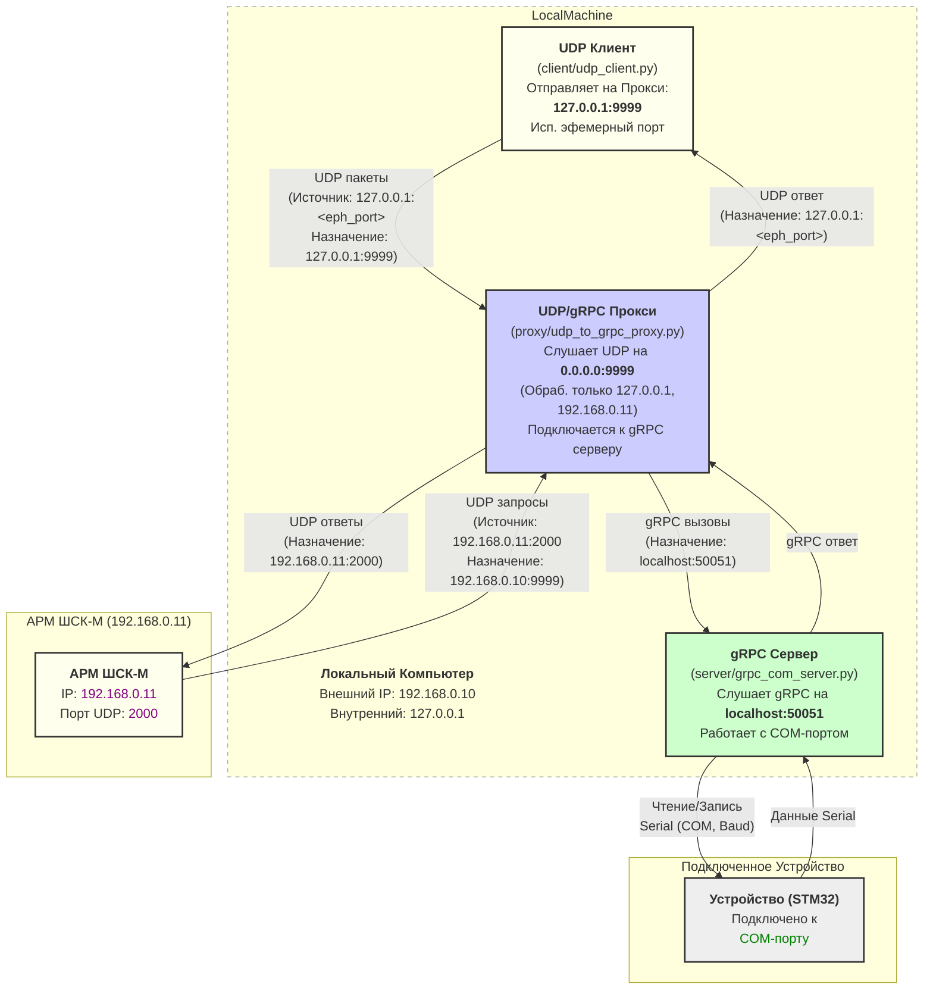

[[gRPC]]

```mermaid
graph TD
    subgraph LocalMachine
        direction TB
        LocalMachineTitle["<b>Локальный Компьютер</b><br>Внешний IP: 192.168.0.10<br>Внутренний: 127.0.0.1"]
        Client["<b>UDP Клиент</b><br>(client/udp_client.py)<br>Отправляет на Прокси:<br><b>127.0.0.1:9999</b><br>Исп. эфемерный порт"]
        Proxy["<b>UDP/gRPC Прокси</b><br>(proxy/udp_to_grpc_proxy.py)<br>Слушает UDP на <b>0.0.0.0:9999</b><br>(Обраб. только 127.0.0.1,<br>192.168.0.11)<br>Подключается к gRPC серверу"]
        Server["<b>gRPC Сервер</b><br>(server/grpc_com_server.py)<br>Слушает gRPC на <b>localhost:50051</b><br>Работает с COM-портом"]
    end

    subgraph "АРМ ШСК-М (192.168.0.11)"
         ARM_ShSK_M["<b>АРМ ШСК-М</b><br>IP: <span style='color:purple'>192.168.0.11</span><br>Порт UDP: <span style='color:purple'>2000</span>"]
    end

    subgraph "Подключенное Устройство"
        Device["<b>Устройство (STM32)</b><br>Подключено к <br><span style='color:green'>COM-порту</span>"]
    end

    Client -- "UDP пакеты<br>(Источник: 127.0.0.1:&lt;eph_port&gt;<br>Назначение: 127.0.0.1:9999)" --> Proxy
    Proxy -- "UDP ответ<br>(Назначение: 127.0.0.1:&lt;eph_port&gt;)" --> Client

    ARM_ShSK_M -- "UDP запросы<br>(Источник: 192.168.0.11:2000<br>Назначение: 192.168.0.10:9999)" --> Proxy
    Proxy -- "UDP ответы<br>(Назначение: 192.168.0.11:2000)" --> ARM_ShSK_M

    Proxy -- "gRPC вызовы<br>(Назначение: localhost:50051)" --> Server
    Server -- "gRPC ответ" --> Proxy

    Server -- "Чтение/Запись<br>Serial (COM, Baud)" --> Device
    Device -- "Данные Serial" --> Server

    style Client fill:#ffe,stroke:#333,stroke-width:2px
    style Proxy fill:#ccf,stroke:#333,stroke-width:2px
    style Server fill:#cfc,stroke:#333,stroke-width:2px
    style Device fill:#eee,stroke:#333,stroke-width:2px
    style ARM_ShSK_M fill:#ffe,stroke:#333,stroke-width:2px
    style LocalMachineTitle fill:none,stroke:none,text-align:center
    style LocalMachine stroke:#aaa,stroke-width:1px,stroke-dasharray: 5 5

%% Пояснения к схеме (уточненная версия):
%% ** Локальный Компьютер: Имеет внешний IP 192.168.0.10 и внутренний 127.0.0.1.
%% ** UDP Клиент: Использует эфемерный (случайный) порт источника. Отправляет UDP запросы только на Прокси (127.0.0.1:9999). Ожидает UDP ответы от Прокси на свой эфемерный порт.
%% ** UDP/gRPC Прокси: Слушает UDP на порту 9999 на всех интерфейсах (0.0.0.0:9999), но обрабатывает запросы только от разрешенных IP (127.0.0.1 и 192.168.0.11). Выступает как gRPC-клиент: *подключается* к gRPC Серверу (localhost:50051). Отправляет UDP ответы на исходный адрес запроса (Клиенту на 127.0.0.1:<eph_port> или АРМ ШСК-М на 192.168.0.11:2000).
%% ** gRPC Сервер: Слушает gRPC на localhost:50051, получает gRPC вызовы от Прокси, отправляет gRPC ответы Прокси. Взаимодействует с устройством через COM-порт.
%% ** АРМ ШСК-М: Находится по адресу 192.168.0.11 и использует порт 2000 для UDP-операций. Отправляет UDP запросы на Прокси (на внешний IP: 192.168.0.10:9999) со своего порта 2000 и получает UDP ответы от Прокси на порт 2000.
```
